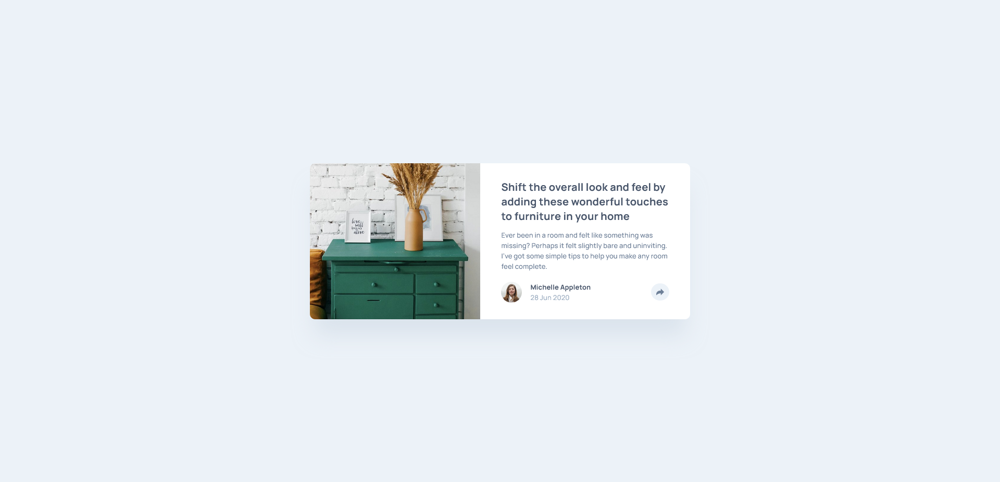
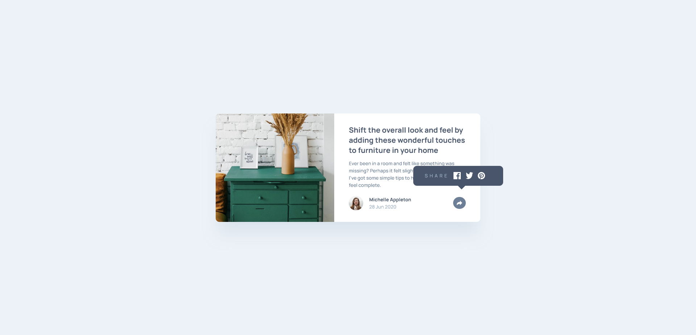
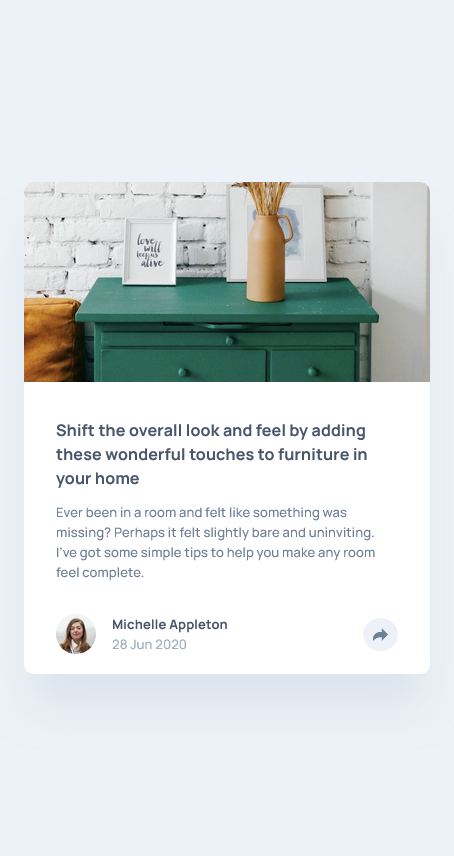
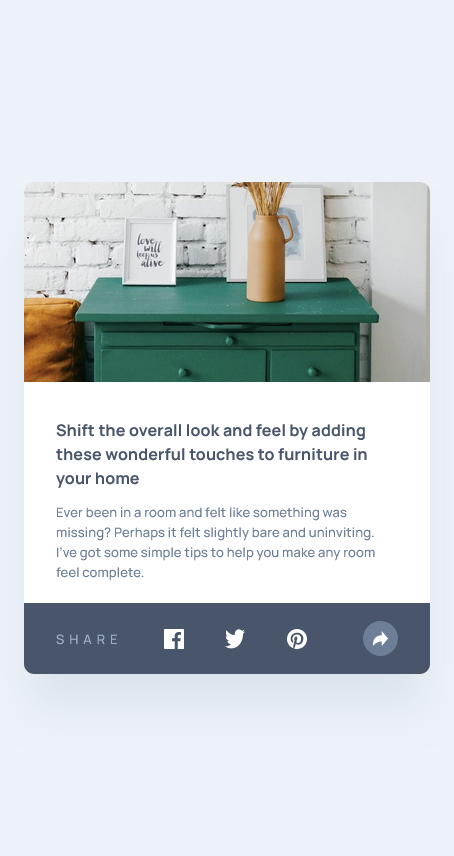

# Frontend Mentor - Article Preview Component Solution

This is a solution to the [Article preview component challenge on Frontend Mentor](https://www.frontendmentor.io/challenges/article-preview-component-dYBN_pYFT).

## Table of contents

- [Overview](#overview)
  - [The challenge](#the-challenge)
  - [Screenshot](#screenshot)
  - [Links](#links)
- [My process](#my-process)
  - [Built with](#built-with)
  - [What I learned](#what-i-learned)
  - [Continued development](#continued-development)
  - [Useful resources](#useful-resources)
- [Author](#author)

## Overview

### The challenge

Users should be able to:

- View the optimal layout for the component depending on their device's screen size.
- See the social media share links when they click the share icon.

### Screenshot

### Links

- Solution URL: [GitHub](https://github.com/wesleyjacoby/Article-Preview-Component)
- Live Site URL: [GitHub Pages](https://wesleyjacoby.github.io/Article-Preview-Component/)

## My process

### Built with

- Semantic HTML5 Markup
- CSS Custom Properties
- Flexbox
- Mobile-first workflow
- [Vue 3](https://vuejs.org/) - JS Framework

### What I learned

I learnt a ton with this project. Although I would usually find this type of design easy, it was my first time using Vue.js. Although this made things easier, it also made it more difficult. However, I'm sure I'll get more familiar with the framework the more I use it.

I also learnt how to deploy the app to GitHub Pages by creating a `deploy.sh` file.

### Continued development

I will continue practicing building projects using Vue.js.

### Useful resources

- [Vue.js Documentation](https://vue-community.org/guide/learning/official-documentation.html) - I often referred to the documentation for help.

## Author

- Frontend Mentor - [@wesleyjacoby](https://www.frontendmentor.io/profile/wesleyjacoby)